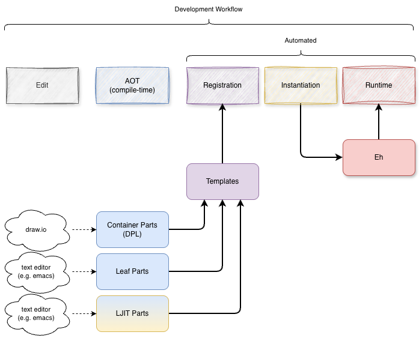

# API for Building and Registering Part Templates

[N.B. I used the Python invocations below. For Javascript, just drop the `zd.` prefix]

The programmer creates Part Templates then registers each part template into the kernel at runtime. Typically, each Leaf Part Template is written as text code and included in main program. For example, in Python, one would create one `.py` file for each Part, then `import` them and `.install` and 
- Container parts by drawing diagrams in draw.io
- Leaf parts by creating code in a textual programming language, like .mpl, or .py, or .js or ...

## Lifecycle

## Leaf Parts

## Container Parts
## LJIT Parts
Load-time just-in-time.

## Create a Template
(akin to creating a `class`)

### mkTemplate
```
zd.mkTemplate (<name>, <template descriptor or null>, <template instantiator function>)
```

Creates a generic part template suitable for inserting into the kernel's part palette (aka "registry") at Registration time.

The first argument is the name of the part template, as it appears on the diagrams.

The second argument is 
- a Container descriptor (a "graph" automatically created from JSON) or 
- null if the template is for a Leaf part
- null if the template is for an LJIT part.

### make_leaf (Leaf or LJIT part)

```
zd.make_leaf (<name with id>,
              <owner>,
              <instance data (akin to self in OOP)>,
              <raw template name of part as a string>,
              <handler>)
```

where the signature of handler is `handler (eh, mev)`, i.e. a part descriptor ("eh") and the triggering mevent (mev). Note that handler is *not* a Python method, hence, is not given a "self" argument. Instance-specific data can be gleaned from `eh.instance_data` which must be set up during `instantiate` and passed in as the 3rd arg to `instantiate` (if needed, else None)

When the kernel generates a new instance of a Part, it checks the first character of the Part template name (i.e. the name that appears on the diagram)
- if the template name begins with ":", the Part is treated specially as a JIT part, 
- otherwise, the Part is assumed to have been registered in the palette (aka "registry") as either a Leaf or a Container.

Leaf parts are compiled before-hand and explicitly registered into the kernel's palette at load time. 

LJIT (Load-time Just in Time) parts are generated at load time when `get_component_instance (...)` is invoked during recursive instantiation of a tree of parts.

To generate and instantiate JIT parts, the kernel (`get_component_instance (...)`) calls the part instantiator and supplies an extra argument - the raw name of the part template (i.e. the name that appears on the diagram, including the ":" first character) - the part instantiator can do anything that it wants, but must return a part instance
 
 Currently, there are 3 use-cases for LJIT (":") parts:
 1. `:?<s>` - generates a probe that displays its name as `<s><subscript>` where `<subscript>` is gensysmed by the kernel
 2. `:$<cmd>` - generates a shell-out that sends the string `<cmd>` to the operating system shell (`<cmd>` may contain spaces, it is simply the full string contained in the on-screen rectangle (remember that the string contains the first two characters ":$")
 3. `:<s>` - sends a string with contents `<s>` to its "" port (the port name is the empty string, which is the default output port akin to `stdout`)

Currently, LJIT parts are only used in the kernel. See `./pbp/kernel/kernel_external.rt` and `./pbp/kernel/external.rt`. This idea is still evolving. In previous versions, we implemented shell-out parts as "external" parts. LJIT, ":" part handling is a generalization that includes handling for making string parts and probe parts.

## make_container
```
zd.make_container (name,owner)
```
## Register a Container or a Leaf Part
zd.register_component (`<palette>`, `<template>`)

